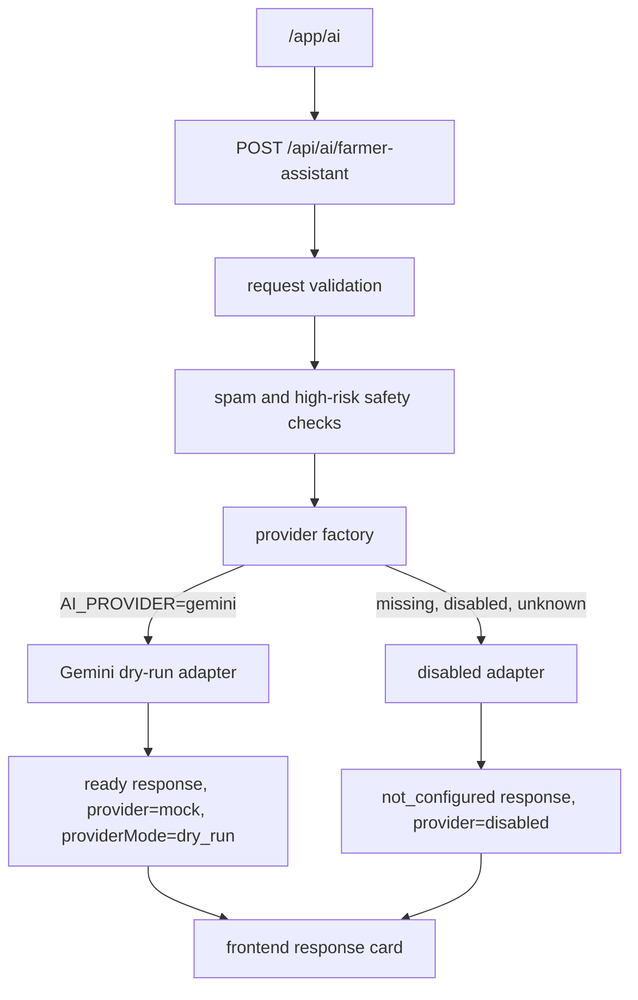

# AI Gemini Dry-Run Adapter M142

Status: dry-run runtime skeleton only. M142 creates the provider adapter layer and Gemini selection path, but it does not call Gemini, does not require `GEMINI_API_KEY`, does not add frontend provider keys, and does not enable live AI output.

## Purpose

M142 prepares the KasetHub farmer assistant backend for a Gemini-first provider architecture while keeping every response non-live and clearly labeled as a test response.

The endpoint remains:

```http
POST /api/ai/farmer-assistant
```

The frontend contract remains:

```text
VITE_AI_BACKEND_CONTRACT_ENABLED=true
```

No provider secret is allowed in frontend code or frontend env.

## Architecture Diagram



## Provider Files

Provider layer:

```text
functions/api/ai/providers/provider-types.ts
functions/api/ai/providers/ai-provider.ts
functions/api/ai/providers/gemini-provider.ts
functions/api/ai/providers/disabled-provider.ts
functions/api/ai/providers/provider-factory.ts
```

Tests:

```text
functions/api/ai/providers/gemini-provider.test.ts
functions/api/ai/providers/provider-factory.test.ts
functions/api/ai/farmer-assistant.test.ts
```

## Provider Interface

The adapter contract is provider-neutral:

```ts
type FarmerAssistantProviderAdapter = {
  providerName: 'gemini' | 'openai' | 'disabled' | 'mock';
  providerMode: 'disabled' | 'dry_run' | 'live';
  getHealth(): FarmerAssistantProviderHealth;
  generateAnswer(request: FarmerAssistantProviderRequest): Promise<FarmerAssistantResponse>;
};
```

Future providers can fit the same shape without rewriting the endpoint:

- Gemini
- OpenAI
- disabled
- mock/local fixture

## Provider Selection

M142 selection rules:

```text
AI_PROVIDER=gemini -> Gemini dry-run adapter
AI_PROVIDER missing -> disabled adapter
AI_PROVIDER=disabled -> disabled adapter
AI_PROVIDER unknown -> disabled adapter
```

`AI_LIVE_ENABLED` is read only as a gate signal for future milestones. In M142:

```text
AI_LIVE_ENABLED=false -> Gemini remains dry-run
AI_LIVE_ENABLED=true -> Gemini still remains dry-run
```

The live flag cannot trigger a live Gemini call in M142.

## Dry-Run Behavior

For a valid safe request with `AI_PROVIDER=gemini`, the backend returns:

```json
{
  "status": "ready",
  "answer": "นี่เป็นคำตอบทดสอบจากระบบ AI เกษตรรุ่นทดลอง ขณะนี้ยังไม่ได้เปิดใช้งาน Gemini จริง",
  "safetyLevel": "caution",
  "provider": "mock",
  "providerMode": "dry_run"
}
```

The dry-run answer:

- does not call Gemini
- does not require `GEMINI_API_KEY`
- does not use `fetch`
- does not claim to be real Gemini output
- includes disclaimers that it is only for connection/UI testing
- keeps follow-up questions farmer-friendly

## Disabled Behavior

If provider config is missing, disabled, or unknown, the backend returns safe disabled copy:

```text
status=not_configured
provider=disabled
providerMode=disabled
```

No raw provider details, stack traces, model names, or secret values are returned.

## Endpoint Flow

M142 endpoint flow:

1. Accept `POST` only.
2. Parse JSON safely.
3. Validate question, topic, user mode, and optional context.
4. Enforce input length.
5. Block obvious high-risk chemical dosage, mixing, and emergency-health requests.
6. Rate-limit obvious spam.
7. Select provider using the provider factory.
8. Execute only disabled or dry-run adapter logic.
9. Return the existing farmer assistant response contract.

No database writes, backend writes, provider calls, OpenAI calls, Gemini calls, or frontend key reads are added.

## Why Live Gemini Is Still Disabled

M142 is a structural milestone, not a provider activation milestone.

Live Gemini remains disabled because the next safety pieces still need to be added:

- output validator skeleton
- Gemini response validator
- timeout wrapper
- provider error mapper
- rollout gate checks
- unsafe-output fallback mapper
- manual QA against controlled outputs

## Future M143 Plan

Recommended next milestone:

```text
M143 Gemini Runtime Guardrail Integration
```

M143 should add:

- output validator skeleton
- Gemini response validator
- provider timeout wrapper
- rollout gate checks
- safety fallback mapper

M143 should still keep:

```text
AI_LIVE_ENABLED=false
```

No live Gemini call should happen in M143.
