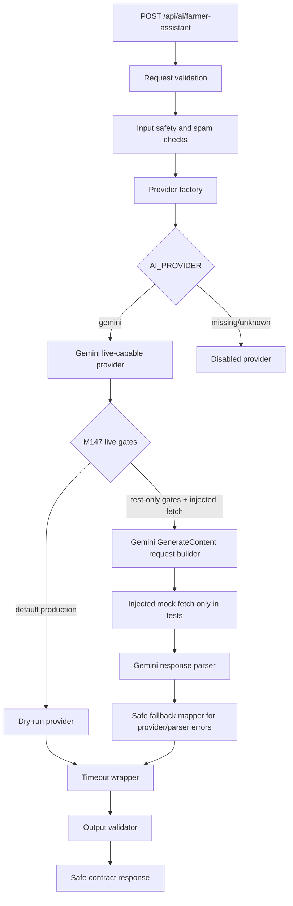

# AI Gemini Live Adapter M147

Status: live-capable backend code exists behind hard gates, but production remains non-live by default. M147 must not run a real Gemini request, must not add a real API key value, and must not expose any provider secret to the frontend.

## Purpose

M147 prepares the first controlled Gemini execution path for a future owner-approved live smoke milestone. The endpoint remains safe by default:

1. `AI_PROVIDER=gemini` with `AI_LIVE_ENABLED=false` returns the existing dry-run/mock answer.
2. `AI_PROVIDER=gemini` with `AI_LIVE_ENABLED=true` still does not live-call Gemini through the production endpoint.
3. A live-capable provider path can be exercised only in unit tests with an injected mock `fetch`.
4. Provider output still passes through the existing endpoint guardrails when the endpoint path is used.

## Adapter Architecture



New M147 code:

- `functions/api/ai/providers/gemini-live-provider.ts`
- live-capable provider factory options in `functions/api/ai/providers/provider-factory.ts`
- expanded rollout gate checks in `functions/api/ai/guardrails/rollout-gate.ts`
- Gemini-specific fallback mappings in `functions/api/ai/guardrails/safety-fallbacks.ts`

## Live Gate Conditions

The live-capable Gemini path is allowed only when all of these are true:

- `AI_PROVIDER=gemini`
- `AI_LIVE_ENABLED=true`
- `GEMINI_API_KEY` exists server-side
- the rollout gate receives explicit internal `allowLiveExecution=true`
- an injected `fetch` implementation is provided

The production endpoint does not pass `allowLiveExecution` or an injected `fetch`, so it remains dry-run/live-blocked after M147.

Gate outcomes:

- missing/disabled provider: `disabled`
- Gemini with live flag missing or false: `dry_run`
- Gemini with live flag true but no internal live allowance: `live_blocked`
- Gemini with live flag true but missing server key: `live_blocked`
- Gemini with live flag true but no injected fetch: `live_blocked`
- all internal gates satisfied: `live`

## Fetch Injection

The live-capable adapter accepts `fetcher` as a dependency. This is deliberate:

- tests can verify request URL, headers, and body without network access
- the adapter cannot accidentally use global `fetch` when a fetcher is not injected
- dry-run mode never calls fetch
- mocked failures can be mapped through safe fallback copy

No Gemini SDK was added in M147. Native `fetch` remains the planned Cloudflare-compatible path.

## Planned Gemini Request

The adapter uses the M145 request builder to prepare a non-streaming text `generateContent` request:

- endpoint path: `models/{model}:generateContent`
- base URL: `https://generativelanguage.googleapis.com/v1beta`
- auth header: `x-goog-api-key`
- body: system instruction, user prompt, generation config, and safety settings
- no image input
- no streaming
- no RAG
- no memory

Reference check on 2026-05-29:

- [Gemini GenerateContent API](https://ai.google.dev/api/generate-content)
- [Gemini API reference and API key header](https://ai.google.dev/api)

Final model name, auth method, endpoint version, and safety categories must still be verified against current Gemini documentation immediately before the first owner-approved live smoke test.

## Response Handling

The adapter uses the M145 parser and error mapper:

- normal mocked text response: parsed to provider-neutral answer, marked internally as `providerMode: "live"` in direct unit tests
- safety-blocked response: safe high-risk blocked fallback
- empty/malformed/missing text response: safe error fallback
- 401/403: safe not-configured fallback
- 429/quota: safe rate-limited fallback
- 5xx or network failure: safe error fallback

Raw provider messages, stack traces, model internals, API URLs containing secrets, and secret-like strings must never be returned.

## Endpoint Behavior After M147

Expected safe behavior:

- no env: `not_configured`
- `AI_PROVIDER=gemini`, `AI_LIVE_ENABLED=false`: dry-run/mock
- `AI_PROVIDER=gemini`, `AI_LIVE_ENABLED=true`, no injected live adapter allowance: dry-run/live-blocked
- high-risk chemical input: blocked before provider selection
- unsafe provider output: replaced by guardrail fallback
- provider timeout: safe timeout fallback

## No-Network Test Strategy

M147 tests use only mocked/no-network inputs:

- dry-run path never requires `GEMINI_API_KEY`
- dry-run path never calls fetch
- live-capable adapter receives a mock fetcher
- request body and `x-goog-api-key` header are inspected with placeholder values only
- mocked Gemini-like normal, blocked, malformed, auth, rate-limit, 5xx, and network-failure responses are mapped safely
- endpoint tests prove `AI_LIVE_ENABLED=true` and a placeholder server-side key still do not call global fetch

## Environment Names

Backend-only:

```text
AI_PROVIDER=gemini
AI_LIVE_ENABLED=false
GEMINI_API_KEY=<Cloudflare secret only>
AI_MODEL=<verify current Gemini model before live activation>
AI_PROVIDER_TIMEOUT_MS=8000
AI_MAX_OUTPUT_TOKENS=700
```

Frontend-safe:

```text
VITE_AI_BACKEND_CONTRACT_ENABLED=true
```

Forbidden frontend/provider-secret env:

```text
VITE_GEMINI_API_KEY
VITE_OPENAI_API_KEY
VITE_AI_PROVIDER_SECRET
```

## Before First Live Smoke

The owner must explicitly approve a later live smoke milestone. Before that smoke:

- verify the current Gemini model name and API shape
- confirm `GEMINI_API_KEY` exists only as a Cloudflare encrypted secret
- confirm no provider key exists in frontend env
- run production dry-run smoke tests
- confirm high-risk blocks still work
- confirm output validator/fallbacks wrap the live endpoint path
- define a rollback: set `AI_LIVE_ENABLED=false`

Recommended next milestone: M148 Owner-Approved Gemini Live Smoke Test Plan + Cloudflare Secret Verification.
