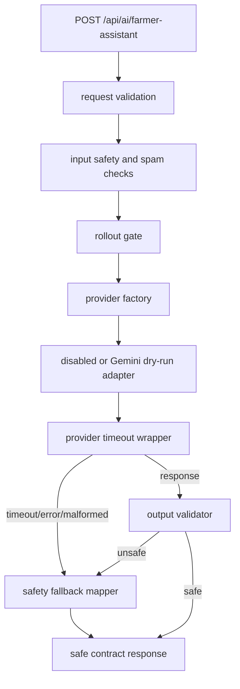

# AI Gemini Runtime Guardrails M143

Status: backend guardrail infrastructure only. M143 keeps Gemini dry-run, does not call Gemini or OpenAI, does not require `GEMINI_API_KEY`, and does not enable live AI output.

## Purpose

M143 adds the runtime safety layers that every future Gemini execution path must pass through before any owner-approved live activation:

- output validator
- safety fallback mapper
- provider timeout wrapper
- rollout gate
- endpoint integration around the dry-run provider path

The endpoint remains:

```http
POST /api/ai/farmer-assistant
```

## Guardrail Flow



No branch in M143 reaches live Gemini execution.

## Output Validator

File:

```text
functions/api/ai/guardrails/output-validator.ts
```

The validator accepts:

- raw answer text
- original question
- optional crop/province/topic
- input or provider safety level
- provider metadata

It returns:

- `allowed`
- `safetyLevel`
- `reasonCodes`
- `sanitizedAnswer`

Deterministic checks:

- dangerous chemical mixing instructions
- confident pesticide/fertilizer dosage without label/source cue
- guaranteed diagnosis, profit, yield, cure, or sale outcome
- fake live weather, price, or market claims
- fake citation/source claims
- human medical emergency advice
- raw provider errors or stack traces
- secret-like strings
- model IDs
- mostly non-Thai output
- overly long output after high-risk input

The validator intentionally uses simple regex/heuristic rules. It is not a full NLP safety classifier.

## Safety Fallback Mapper

File:

```text
functions/api/ai/guardrails/safety-fallbacks.ts
```

The fallback mapper converts validator or provider failures into safe contract responses:

- `dangerous_chemical_mixing` -> `blocked`, `high_risk`
- `confident_chemical_dosage` -> `blocked`, `high_risk`
- `human_medical_emergency_advice` -> `blocked`, `high_risk`
- `fake_live_data_claim` -> cautious `ready` response with no fake data
- `fake_citation_claim` -> cautious `ready` response with no fake citation
- `guaranteed_outcome` -> cautious `ready` response
- `provider_timeout` -> safe `error`
- `provider_malformed_response` -> safe `error`
- `raw_provider_error`, `model_id_output`, `secret_like_output` -> safe `error`
- `mostly_non_thai` -> safe `error`

Fallback copy is natural Thai and avoids provider internals, stack traces, model IDs, or secret names.

## Provider Timeout Wrapper

File:

```text
functions/api/ai/guardrails/provider-timeout.ts
```

Behavior:

- wraps provider `generateAnswer()`
- defaults to `8000 ms`
- reads `AI_PROVIDER_TIMEOUT_MS` through the endpoint
- caps timeout at `30000 ms`
- returns reason codes instead of throwing raw errors
- maps malformed provider responses to `provider_malformed_response`

M143 tests use mocked promises only.

## Rollout Gate

File:

```text
functions/api/ai/guardrails/rollout-gate.ts
```

Gate modes:

- `disabled`
- `dry_run`
- `live_blocked`

Rules:

```text
AI_PROVIDER missing/disabled -> disabled
AI_PROVIDER=gemini and AI_LIVE_ENABLED missing/false -> dry_run
AI_PROVIDER=gemini and AI_LIVE_ENABLED=true -> live_blocked
unknown provider -> disabled
```

The provider factory still returns Gemini dry-run for Gemini in M143. `live_blocked` is a deliberate marker that future live execution is not available yet.

## Endpoint Integration

`functions/api/ai/farmer-assistant.ts` now:

1. validates request shape
2. keeps existing high-risk input block
3. keeps existing spam/rate-limit fixture
4. selects disabled or Gemini dry-run provider
5. runs provider through timeout wrapper
6. validates provider answer
7. maps unsafe/timeout/malformed/error output through safety fallback
8. returns the same farmer assistant contract shape

No database writes, provider network calls, Gemini calls, OpenAI calls, or frontend provider keys are added.

## Why Live Gemini Remains Disabled

M143 only adds the guardrail infrastructure. Live Gemini still needs a production contract QA and Cloudflare env setup milestone before any owner-approved activation.

Live execution remains blocked because:

- `AI_LIVE_ENABLED=true` maps to `live_blocked`, not live
- provider factory still returns dry-run Gemini adapter
- no Gemini SDK or API endpoint is called
- no `GEMINI_API_KEY` is required
- no frontend env key is added

## M144 Recommendation

Recommended next milestone:

```text
M144 AI Production Contract QA / Cloudflare Gemini Env Setup Guide
```

M144 should:

- document Cloudflare env setup for Gemini
- confirm `AI_PROVIDER=gemini`
- confirm `GEMINI_API_KEY` is secret only
- confirm `AI_LIVE_ENABLED=false`
- test production disabled/dry-run state
- prepare owner approval checklist

M144 should still make no live Gemini call.
